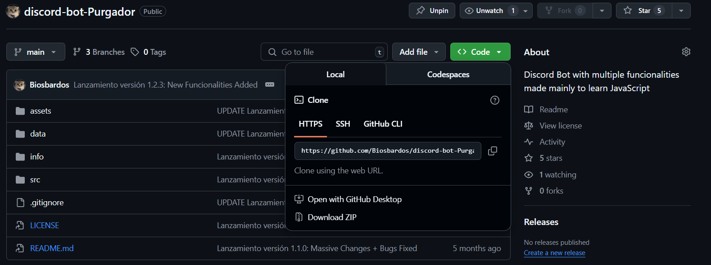

# discord-bot-Purgador

**discord-bot-Purgador** is a feature-rich Discord bot designed primarily as a JavaScript learning project. It offers a variety of fun, moderation, and utility commands tailored for a specific Discord server. 

While the bot is customized for personal use, its codebase may serve as a learning resource or template for similar projects, Discord-API related applications via discord.js library.

---

## ⚡ Features

### General User Commands

- `-comandos`: Displays all available commands.
- `-avatar`: Shows the bot's profile picture.
- `-banner`: Shows the bot's banner image.
- `-pececin`: Sends a random image of "Pececin" (with festive variations).
- `-cores`: Sends a random "bullying" image of "Cores" (including festive images).
- `-chanti`: Sends a random "bullying" image of "Santi".
- `esencia`: Reveals "the true essence".
- `-play`: Opens a menu to select and play a playlist in a voice channel, with customizable repeat counts.
- `-stop`: Stops audio playback in the voice channel.
- `-help`: Shows advanced help (or jokes about it).
- `-function.on`: Activates repetitive messages in a specific channel.
- `-function.off`: Deactivates repetitive messages.
- `reaction`/`no reaction`: Toggles a special bot-user interaction mode (exclusive to the bot's owner).
- `-working.on`/`-working.off`: Activates/deactivates "work status" tracking (exclusive to owner).

### Administrator-Only Commands

- `-borrar <n>`: Deletes the last `n` messages from a channel.
- `-bot on`/`-bot off`: Activates or deactivates the bot.
- Admin commands are delivered via DM for privacy.

### Utility

- Presence and status tracking for members.
- Customizable repetitive reminders/messages (with interval selection via interactive buttons).
- Personalized bot replies.
- Audio playback with scheduling and looping capabilities.
- Usage of custom images and memes unique to the server community.
- Daily good morning messages and late-night reminders to go to sleep.
- Monthly tracking of the bot's development time.
- Custom auto-reactions to different messages.

## 🚨 Important Notice

**This bot is heavily tailored for a specific Discord server.** 

Many elements of its structure —such as users, roles, and channels— are unique to that environment and may not function properly elsewhere.

Sensitive information such as the bot TOKEN, member IDs, role IDs, channel IDs, and personal images are **NOT** included in this repository. 

To make the bot work in a different server, you'll need to adapt the provided code to fit your own resources.

## 🛠️ Setup & Usage

1. **Get the code**

    Clone this repository by typing the following in CMD:

    ```bash
    git clone https://github.com/Biosbardos/discord-bot-Purgador
    ```
    
    or click on "Download ZIP" (you will need to unzip it somewhere in your pc)

    

2. **Install dependencies**
   
    No need — they’re already included. I know, not ideal (but easier for non-coders).

3. **Configure required environment variables and resource files**
    - Add your bot token, channel/user/role IDs, and image assets as required.
    - Review the code for all places marked with sensitive or server-specific information.

4. **Run the bot**

    Open CMD in the `src` folder of the project and type:

    ```bash
    node index.js
    ```

**DON'T FORGET**

You will need to generate a valid token from the [Discord Developer Portal](https://discord.com/developers/applications):

1. Log in and click **"New Application"**.
2. Give your bot a name and click **"Create"**.
3. In the left sidebar, go to **"Bot"** and click **"Add Bot"**.
4. Click **"Reset Token"** and then **"Copy"** to get your token.
5. Paste this token into the appropriate place in your code or environment file.

⚠️ **Important:** Never share your token publicly. It gives full control over your bot.


## 🤝 Contributing

This project was created for personal learning and use so, no pull requests will be accepted. However, suggestions made in the Discussions section will be heard and taken into account.

Feel free to use, learn from, adapt or fork the code for your own Discord bot projects!

---

**Made with ❤️ and JavaScript.**